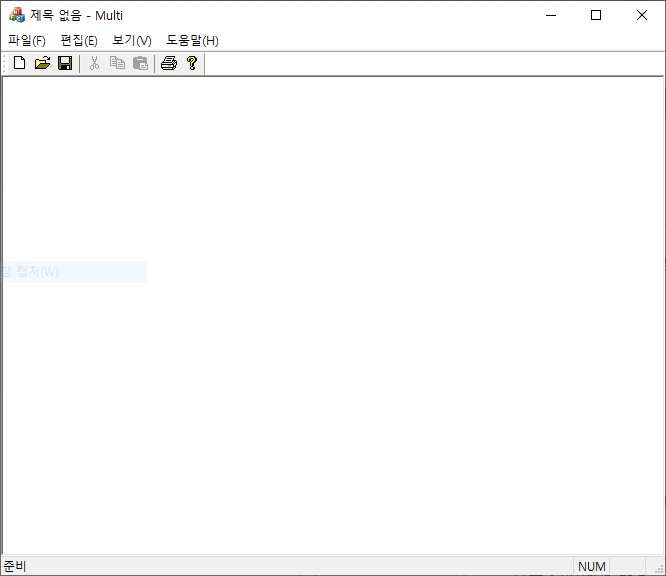
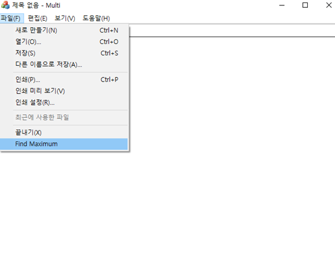
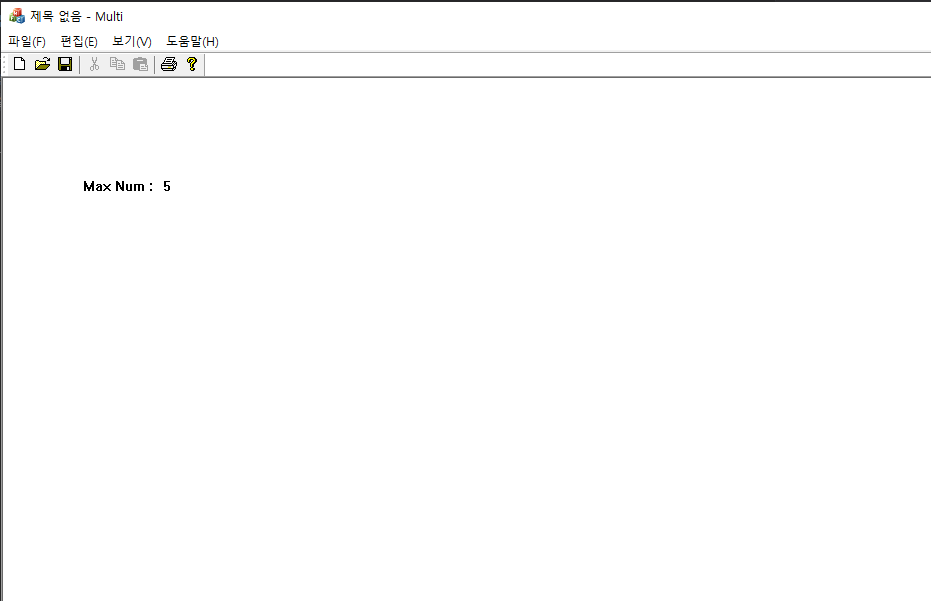
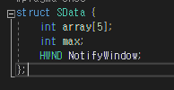
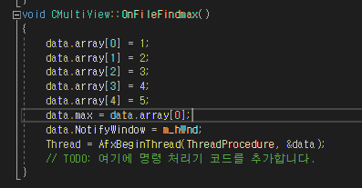
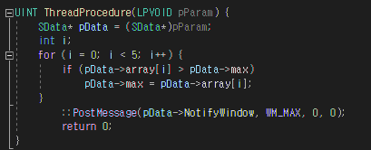
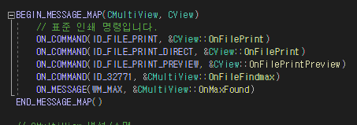
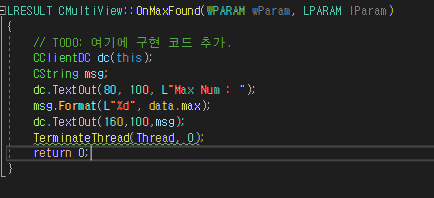

# Multi

## 실행 결과

1.

첫 화면입니다.

2.

Find Maximum 을 실행합니다.

Find Maximum 을 실행하게 되면

내부에 선언되어 있는 Array 배열에서

가장 큰 값을 찾아내어 출력합니다.

3.

1,2,3,4,5 중 가장 큰 값인 5를 찾아낸 모습입니다.

--------------------------------------------------------------------------------------------
## 내부 코드
1.

MultiView.h에 정수 배열 5개의 정수와 

HWND를 가지는 구조체를 정의 합니다.

2.

메뉴를 선택하면 쓰레드가 시작이 되고

구조체 속 정수 배열에 1,2,3,4,5를 넣고

HWND에는 현재의 윈도우 m_hWnd 저장시킵니다.

또한 ThreadProcedure 함수를 호출 합니다. 데이터는 data에 전달됩니다.

3.

최댓값을 찾고 WM_MAX를 발생시킵니다.

4.

WM_MAX가 발생하면 OnMaxFound 함수를 발생시킵니다.

5.

data값의 최댓값을 출력합니다.

---------------------------------------------------------------------------------------------------------------
꽤나 복잡한 코드 였습니다.

그럼에도 열심히 한 결과 훌륭한 결과물이 나왔습니다.

멀티 쓰레드를 돌려 여러 과정을 한번에 해냈습니다.

데이터를 구조체에 담고... 쓰레드 함수에 전달하고.. 

함수에서는 최댓값을 찾고.. 호출한 곳에 메시지를 보내어

최댓값을 화면에 출력한다..

이 복잡한 내용을 쉽고 간단하게 설명을 도와주신

심재창 교수님께 찬사를 보냅니다!
